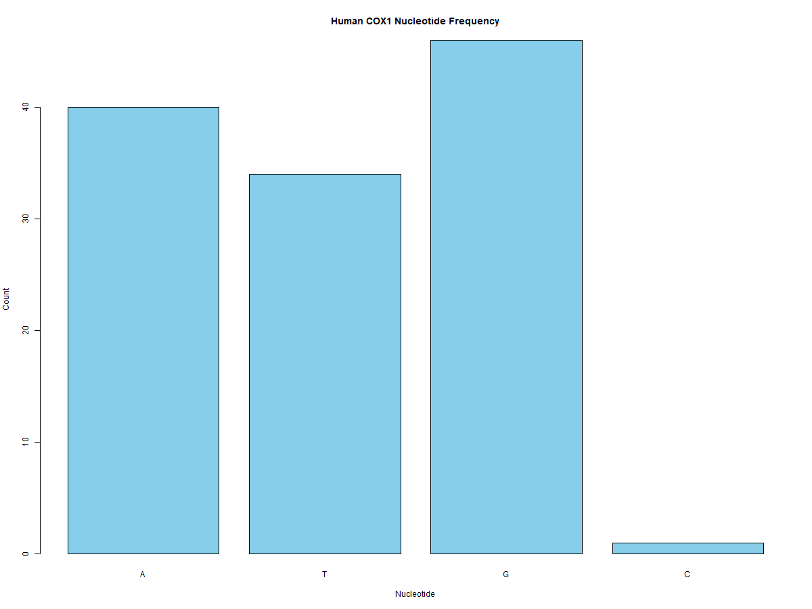
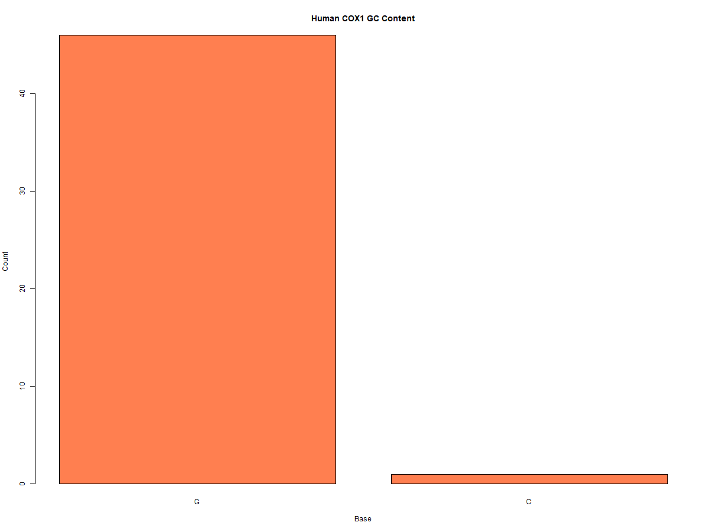

# Human COX1 Gene Analysis 🧬

This repository contains a bioinformatics workflow for the analysis of the **Human Cytochrome c Oxidase Subunit I (MT-CO1)** mitochondrial gene. 

The COX1 gene is a critical component of the mitochondrial electron transport chain. In this project, I use R to examine the primary structure of the human sequence, identifying key genomic features and translating the sequence into its functional protein product.

Nucleotide Composition: Calculation of A, T, G, and C frequencies.
GC-Content Mapping: Analysis of genomic stability and thermal melting points.
Motif Discovery: Searching for regulatory elements (Start/Stop codons, CpG islands).
ORF Detection & Translation: Identification of the longest Open Reading Frame and subsequent protein sequence generation.

📊 Visual Results
#Nucleotide Distribution
The frequency analysis shows a clear preference for A, T, and G over C in this specific mitochondrial sequence.

#GC Content Summary
GC content is a vital metric for genomic stability and thermal melting point predictions.

Project Structure
`human_cox1_analysis.R`: The complete R script using the Biostrings library.
`COX1_Human.fasta`: Raw genomic sequence data retrieved from NCBI.
